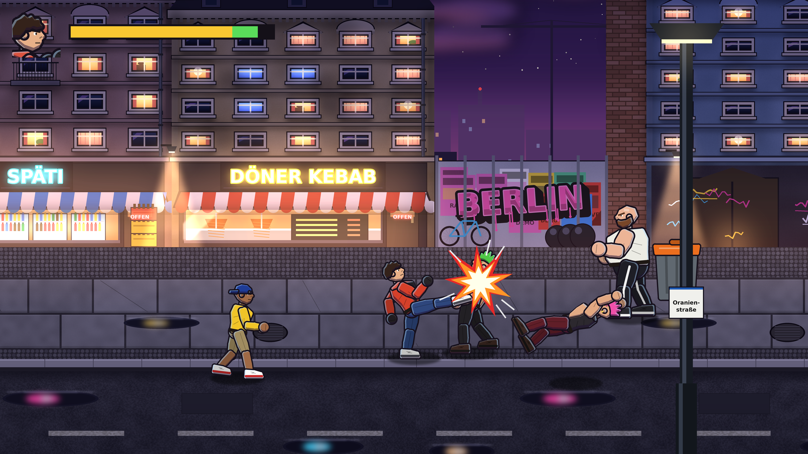
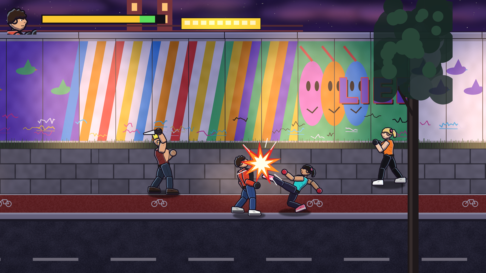
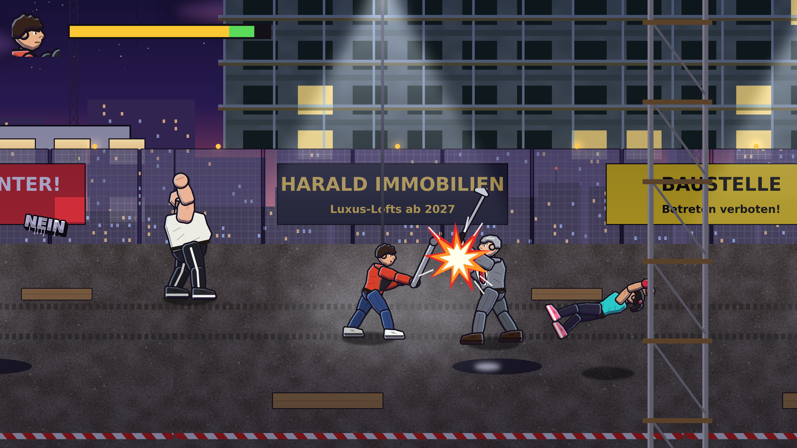
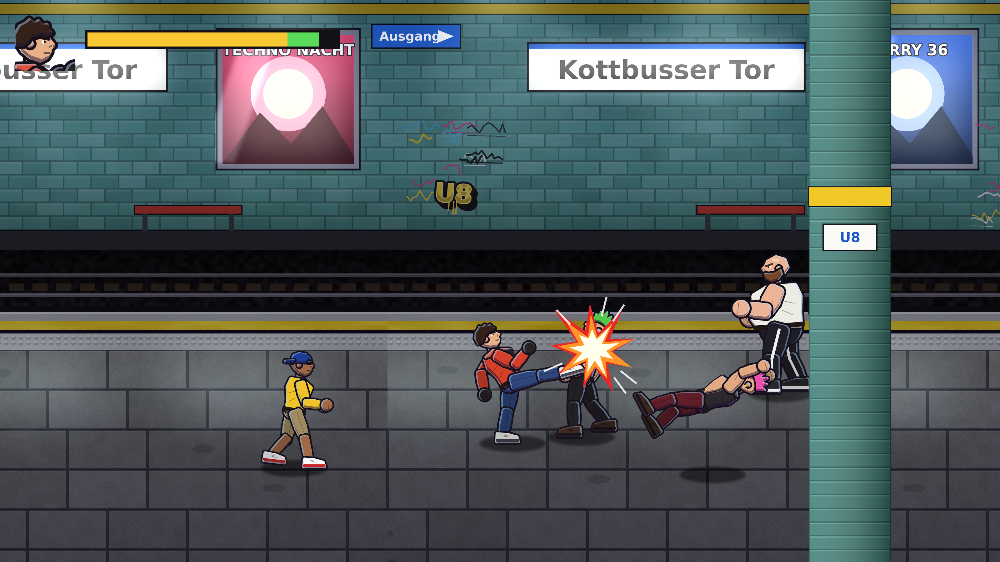

# Streets of Berlin

Ein 2D-Beat-'em-Up im Stil von *Streets of Rage 4*. Alles ist von Grund auf neu gebaut: Spiellogik in
JavaScript (Canvas), dazu **prozedural erzeugte Grafiken** (Figuren, Gegner, Level, Effekte, UI) und
**Sounds und Musik**. Alles lässt sich per Skript neu erzeugen.

Das Spiel läuft als **Windows-Programm** (`StreetsOfBerlin.exe`, gebaut mit Electron) und als **Browser-Version**.
Beide nutzen denselben Code (`web/`). Dazu gibt es eine **KI-Pipeline** (`Tools/AIGen`), mit der sich die Figuren über
ComfyUI im gezeichneten Comic-Stil neu generieren lassen, in exakt den Posen des Spiels.






## Inhalt

| Bereich | Umfang |
|---|---|
| Spielfiguren | **Kai** (ausgewogen, viel Energie): 4er-Combo (Jab → Gerade → Uppercut → Kick), Flugkick, Rückwärts-Ellbogen, Spezial *Wirbelwind* (trifft rundum).<br>**Leyla** (schnelle Kickboxerin aus Neukölln, weniger Energie, mehr Reichweite): Jab → Front-Kick → Knie → Dreh-Roundhouse, *Hechtsprung-Kick* schräg nach unten, Esel-Tritt nach hinten, Spezial *Helikopter-Kick* mit Mehrfachtreffern.<br>Beide: Spezialangriff kostet Energie, die man wie in SoR4 durch Treffer zurückholt; Griff mit Knie ×3 oder Wurf; Essen und Waffen aufheben |
| Gegner | **Kalle / Ronny** (Punks, Haken), **Messer-Micha** (sticht und wirft sein Messer), **Jojo / Deniz** (Skater, Rutschkick), **Zoe / Nina** (Kickboxerinnen, schnelle Kicks, fliegender Roundhouse), **Brecher** (schwer, Super-Armor, Sturmangriff) |
| Bosse | Stage 1 **Türsteher Rolf** · Stage 2 **Hool-Sven** mit Baseballschläger · Stage 3 **Baulöwe Harald** mit Golfschläger, Sprungkicks und Verstärkung bei 66 %/33 % Energie. Alle mit Wut-Phase unter 50 % |
| Waffen | **Rohr, Baseballschläger, Messer, Flasche, Golfschläger**: aufheben mit Schlag, zuschlagen mit Schlag, werfen mit Rückschlag. Haltbarkeit pro Waffe, Flaschen zerbrechen, Gegner lassen ihre Waffen beim Umfallen fallen. Die Waffe sitzt über Hand-Anker pro Animations-Frame in der Hand |
| Kampfsystem | aktive Hit-Frames, Hitstop, Screenshake, Hitstun, Knockdown mit Aufprall-Hüpfer, Jonglieren, geworfene Gegner werfen andere um, Unverwundbarkeit beim Aufstehen, Angriffs-Tokens (maximal 2 Gegner greifen gleichzeitig an) |
| Stage 1 | *Kreuzberg bei Nacht*: Oranienstraße (Späti, Döner, Brandwand mit Fernsehturm) → U-Bahnhof Kottbusser Tor |
| Stage 2 | *East Side Gallery*: Mauer-Wandbilder, Oberbaumbrücke mit U1 → Club-Hinterhof mit Lichterketten und Container-Bar |
| Stage 3 | *Baustelle am Alex*: Rohbau mit Gerüst, Flutlicht, „Harald Immobilien“-Banner → Showdown auf dem Dach über der Stadt |
| Ablauf | je Stage 6 Kampfabschnitte mit Kamera-Sperre und „GO →“-Pfeil, Stage-Wechsel mit Punkte-Übernahme, Abspann |
| Menüs | Titelmenü, **Figurenauswahl** (Werte + Moves), **Optionen**: Musik an/aus + Lautstärke, Sounds an/aus + Lautstärke, **Steuerung anpassen** (2 Tasten + 1 Gamepad-Knopf pro Aktion, Tausch bei Doppelbelegung, Standard wiederherstellen), Pause-Menü (Weiter / Optionen / Zum Titel). In der .exe außerdem **Vollbild** und **Beenden**. Alles wird gespeichert |
| Extras | zerstörbare Mülltonnen/Obstkisten mit Döner (volle Heilung), Currywurst und Geld, Combo-Zähler, Punkte, 3 Leben mit Wiedereinstieg, Game Over, Stage Clear, Zeitlupe beim Boss-KO |

## Schnellstart

**Spielen unter Windows:** `StreetsOfBerlin-win-x64.zip` entpacken und `StreetsOfBerlin.exe` starten. Der ganze Ordner
muss zusammenbleiben; eine Installation ist nicht nötig. Die ZIP entsteht automatisch bei jedem Push auf `main`
(GitHub → *Actions* → *Desktop-Build* → *Artifacts*). Bei einem Tag wie `v1.0.0` wird sie zusätzlich als Release
veröffentlicht.

**Selbst bauen** (Windows, Linux oder macOS, Node.js ≥ 20):

```bash
cd desktop
npm install
npm start               # direkt spielen (Entwicklung)
npm run build:win       # -> desktop/dist/StreetsOfBerlin-win32-x64/StreetsOfBerlin.exe + StreetsOfBerlin-win-x64.zip
npm run build:linux     # -> desktop/dist/StreetsOfBerlin-linux-x64/StreetsOfBerlin
```

Die Windows-.exe lässt sich auch unter Linux bauen: Icon und Versionsinfo setzt `build.mjs` mit *resedit*, Wine ist
nicht nötig. Hängt der Download von Electron hinter einem Proxy, das passende `electron-vX-win32-x64.zip` selbst laden
und mit `node build.mjs --platform win32 --electron-zip-dir <ordner>` bauen.

**Vollbild:** F11 oder Alt+Enter, oder *Optionen → Vollbild* (wird gespeichert). Einstellungen und Tastenbelegung
liegen im Benutzerprofil (`%APPDATA%\Streets of Berlin`).

## Steuerung

Standardbelegung – änderbar unter **Optionen → Steuerung anpassen** (Eintrag wählen, *Enter*, neue Taste bzw.
Gamepad-Knopf drücken; *Rücktaste* leert die Taste, *Esc* bricht ab). Menüs lassen sich unabhängig von der Belegung
immer mit Pfeilen/D-Pad, *Enter*/A und *Esc*/B bedienen, im Browser auch per Maus oder Antippen.

| Aktion | Tastatur | Gamepad |
|---|---|---|
| Laufen (8 Richtungen) | WASD / Pfeiltasten | Linker Stick / D-Pad |
| Schlag / Aufheben | J | X (Xbox) / □ |
| Sprung (+ Schlag = Sprungkick) | K / Leertaste | A / ✕ |
| Spezialangriff | L | Y / △ |
| Rückschlag (nach hinten) / Waffe werfen | I | B / ○ |
| Start / Pause | Enter / P (Esc pausiert immer) | Start |

**Griff:** in einen Gegner hineinlaufen. Dann *Schlag* = Knie (das dritte wirft um), *weg drücken + Schlag* = Wurf,
*Sprung* = loslassen. Die Combo läuft nur weiter, wenn die Schläge treffen – sonst beginnt sie wieder beim Jab.

## Browser-Version

`web/` enthält das komplette Spiel. `desktop/` verpackt genau diese Dateien in die .exe. Zum Entwickeln reicht ein
lokaler Webserver:

```bash
python Tools/WebBuild/build_web.py               # Texturatlanten + Hintergründe nach web/assets (≈7 MB)
python -m http.server 8000 --directory web       # dann http://localhost:8000 öffnen
```

URL-Parameter: `?stage=2` (direkt in Stage 2/3 starten), `?char=leyla` (Figur vorwählen), `?mute`,
`?autoplay&god&speed=8` (Bot spielt selbst).

**Automatischer Playtest** (headless Chromium über Playwright): Laden im abgeschotteten iframe, Titelmenü und
Figurenauswahl per Tastatur, Laufen und Schlagen; dann Optionsmenü (Musik/Sounds aus, Lautstärke, Schlag-Taste auf *U*
umbelegen), Spiel mit Leyla inklusive Spezialangriff und Pause-Menü, Prüfung der gespeicherten Einstellungen nach dem
Neuladen. Zum Schluss spielt ein Bot mit Kai und mit Leyla alle drei Stages bis zum Abspann durch; dabei wird auf
JavaScript-Fehler geprüft.

```bash
npm i playwright                                  # einmalig
python -m http.server 8765 --directory web &
node Tools/WebBuild/playtest.mjs --out playtest-out
```

Nach Änderungen an `web/js/*.js` das Bündel neu bauen: `python Tools/WebBuild/bundle.py` (macht `build_web.py` mit).

**Test der Desktop-Version:** `desktop/smoke-test.mjs` startet die App über Playwright/Electron. Geprüft werden das Laden
über `app://`, das Titelmenü mit *Beenden*, die Vollbild-Umschaltung und das Spielen. Mit `--full` spielt zusätzlich ein
Bot alle Stages durch. Mit `--exe <pfad>` wird ein gepacktes Build getestet. Im CI läuft das auf Windows gegen die
fertige `StreetsOfBerlin.exe`.

## KI-Figuren (ComfyUI)

`Tools/AIGen` erzeugt aus jeder Spielpose ein OpenPose-Skelett, eine Strichzeichnung und eine Maske und lässt
ComfyUI (SDXL + ControlNet, optional LoRA) die Frames im Comic-Stil malen. Danach wird freigestellt, auf die
Silhouette ausgerichtet und nach `Art/Custom` geschrieben. Details und Tipps zur Einheitlichkeit:
[`Tools/AIGen/README.md`](Tools/AIGen/README.md).

```bash
python Tools/AIGen/generate.py --char Kai --anim idle --checkpoint MEIN_SDXL.safetensors
python -m unittest Tools/AIGen/tests/test_pipeline.py -v   # Test ohne GPU gegen einen Fake-ComfyUI-Server
```

## Grafiken & Sounds neu erzeugen

Alle Assets entstehen aus Code in `Tools/ArtGen` (Python 3 mit Pillow + NumPy):

```bash
pip install pillow numpy
python Tools/ArtGen/generate_all.py      # erzeugt Art/Generated/** und manifest.json
python Tools/ArtGen/preview_scene.py     # Vorschaubilder (optional)
```

Danach `python Tools/WebBuild/build_web.py` ausführen (Texturatlanten für das Spiel) und die .exe neu bauen.

**Auflösung:** Alle Grafiken entstehen in doppelter Auflösung (`SOB_RES=2`, scharf bis 4K). Das Spiel rechnet in
1600×900-Welt-Einheiten und skaliert die Atlanten entsprechend. `SOB_RES=1` erzeugt schnelle Test-Versionen,
`SOB_RES=3` noch schärfere.

**Eigene oder KI-generierte Bilder:** PNGs mit gleichem Namen in `Art/Custom/<Ordner>/` ersetzen die generierten
Versionen automatisch (Größen und Tipps: [`Art/Custom/README.md`](Art/Custom/README.md)). Sie werden beim nächsten
`generate_all.py` + `build_web.py` übernommen.

| Datei | Inhalt |
|---|---|
| `bgkit.py` | Mal-Werkzeuge: Verläufe, Putz-/Materialrauschen, weiches Licht (Glow, Lichtkegel, Schatten), Nacht-Grading mit leuchtenden Flächen, Neon-Schrift, Graffiti, Ziegel, Plakate |
| `puppet.py` | 2D-Puppet-Renderer: Figuren aus Körperteilen, dicke Konturen, Cel-Shading mit violetten Schatten, Glanzkante, Neon-Randlicht, Stoff-Details |
| `characters.py` | Aussehen aller Figuren + sämtliche Animationsposen (Gelenkwinkel pro Frame) |
| `backgrounds2.py` | Stage 2 (East Side Gallery mit eigenen Wandbildern, Oberbaumbrücke, Club-Hinterhof) und Stage 3 (Baustelle, Kräne, Fernsehturm, Dach mit Stadtpanorama) |
| `backgrounds.py` | Gemalte Kulisse: Nachthimmel mit Wolken, Mond, Fernsehturm und Skyline im Dunst; Altbauten mit Stuck, Balkonen, beleuchteten Wohnungen, Schmutzfahnen; Späti, Döner, Kiosk, Club, Litfaßsäule, U-Bahn-Eingang; nasser Gehweg mit Neon-Spiegelungen; U-Bahnhof mit Fliesen, Leuchtröhren, Werbung, Gleisbett |
| `effects.py` | Trefferfunken, Staub, Spezial-Ring, Schatten, Tonnen/Kisten, Döner/Currywurst/Geld, GO-Pfeil, Logo |
| `audio.py` | Synthetisierte Treffer-, Wurf-, KO-, Pickup-Sounds und ein Synthwave-Musikloop |

Eigene Figuren: in `characters.py` eine neue `Character(...)` anlegen (Farben, Frisur, Proportionen) und einen
Animationssatz (`player`, `player2`, `punk`, `skater`, `heavy` …) zuweisen. Im Spiel genügt dann ein Eintrag in
`ENEMIES` bzw. `PLAYERS` (`web/js/data.js`) und ein Name in den Gegnerwellen der Stages.

## Aufbau

```
web/                    das Spiel (läuft im Browser und in der .exe)
 ├─ index.html          Seite mit Canvas 1600×900 (wird auf Fenstergröße skaliert)
 ├─ js/main.js          Laden, feste 60-Hz-Spiellogik, URL-Parameter
 ├─ js/game.js          Ablauf (Titel/Intro/Spiel/Clear/GameOver/Abspann), Stages, Kampfabschnitte & Wellen,
 │                      Kamera, Punkte, Combo, Angriffs-Tokens, HUD, Eingabe, Audio, Vollbild, Test-Bot
 ├─ js/entities.js      Fighter-Zustandsmaschine, Angriffe mit aktiven Frames, Treffer, Knockdown, Griffe/Würfe,
 │                      Waffen; Player (Profile Kai/Leyla), Enemy-KI, Props, Pickups, Projektile, Effekte
 ├─ js/data.js          Balancing: Figuren, Angriffe, Gegner, Waffen, Stages
 ├─ js/menu.js          Titel, Figurenauswahl, Optionen, Steuerung (Neubelegen), Pause – Tastatur/Gamepad/Maus/Touch
 ├─ js/settings.js      Einstellungen + Tastenbelegung (localStorage)
 ├─ js/touch.js         Touch-Steuerung für Handys/Tablets
 ├─ js/bundle.js        alle Module + Daten in einer Datei (von Tools/WebBuild/bundle.py erzeugt)
 └─ assets/             Texturatlanten, Hintergründe, Sounds (von Tools/WebBuild/build_web.py erzeugt)
desktop/                Electron-Hülle für die .exe
 ├─ main.js             Fenster, Protokoll app://game/, F11/Alt+Enter, Einzelinstanz, keine fremden Seiten
 ├─ preload.js          window.sobDesktop: Beenden und Vollbild (sonst kein Systemzugriff für die Seite)
 ├─ build.mjs           kopiert web/ nach desktop/app und packt mit @electron/packager, setzt Icon/Version, ZIP
 └─ smoke-test.mjs      automatischer Test der App bzw. der gebauten .exe
Tools/ArtGen            Grafiken & Sounds aus Code
Tools/WebBuild          Atlanten/Bündel bauen, Browser-Playtest
Tools/AIGen             KI-Pipeline (ComfyUI)
.github/workflows       Desktop-Build: .exe auf Windows bauen, testen, als ZIP/Release bereitstellen
```

**Koordinaten:** Die Spiellogik rechnet in *(X, Tiefe, Höhe)*. Figuren weiter hinten stehen weiter oben im Bild und
werden zuerst gezeichnet.

**Balancing** passiert in `web/js/data.js` (Figuren, Angriffe, Gegner, Waffen, Stages und Wellen).

## Bekannte Punkte / Ideen für später

- Die .exe ist nicht signiert. Windows SmartScreen fragt deshalb beim ersten Start nach („Weitere Informationen →
  Trotzdem ausführen“). Für eine Veröffentlichung wäre ein Code-Signing-Zertifikat nötig.
- Die frühere Unreal-Engine-Fassung (C++) ist entfernt, bleibt aber in der Git-Historie erhalten (bis Commit `687aaf4`).
- Eine weitere Figur braucht: Eintrag in `Tools/ArtGen/characters.py` (Aussehen + Animationen) und ein Profil in
  `web/js/data.js` (`PLAYERS`). Figurenauswahl, HUD und Portrait laufen automatisch über den Namen.
- Mögliche Erweiterungen: Blitz-Move (Vorwärts-Vorwärts + Schlag), zweiter Spieler gleichzeitig, Star-Moves, weitere Stages
  (Tempelhofer Feld, Berghain-Schlange 😉), Figuren-LoRAs für die KI-Pipeline.
