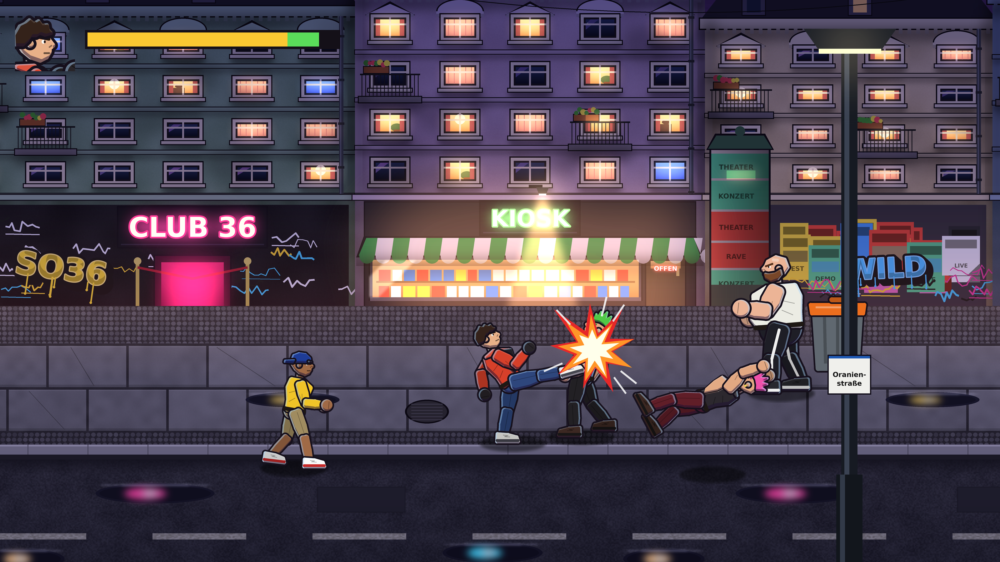

# Streets of Berlin

Ein 2D-Beat-'em-Up für die **Unreal Engine 5** im Stil von *Streets of Rage 4*. Alles ist von Grund auf neu gebaut:
Spiellogik in C++ (Paper2D), dazu **prozedural erzeugte Grafiken** (Figuren, Gegner, Level, Effekte, UI) und
**Sounds und Musik**. Alles lässt sich per Skript neu erzeugen.





## Inhalt

| Bereich | Umfang |
|---|---|
| Spielfigur | **Kai**: 4er-Combo (Jab → Gerade → Uppercut → Kick), Sprungkick, Rückwärts-Ellbogen, Spezialangriff (kostet Energie, die man wie in SoR4 durch Treffer zurückholt), Griff mit Knie ×3 oder Wurf, Essen aufheben |
| Gegner | **Kalle / Ronny** (Punks, Haken), **Jojo / Deniz** (Skater, Rutschkick), **Brecher** (schwer, Super-Armor, Sturmangriff), Boss **Türsteher Rolf** (Wut-Phase unter 50 % Energie) |
| Kampfsystem | aktive Hit-Frames, Hitstop, Screenshake, Hitstun, Knockdown mit Aufprall-Hüpfer, Jonglieren, geworfene Gegner werfen andere um, Unverwundbarkeit beim Aufstehen, Angriffs-Tokens (maximal 2 Gegner greifen gleichzeitig an) |
| Stage 1 | *Kreuzberg bei Nacht*: Oranienstraße (Späti, Döner, Brandwand mit Fernsehturm) → U-Bahnhof Kottbusser Tor → Bosskampf. 6 Kampfabschnitte mit Kamera-Sperre, „GO →“-Pfeil |
| Extras | zerstörbare Mülltonnen/Obstkisten mit Döner (volle Heilung), Currywurst und Geld, Combo-Zähler, Punkte, 3 Leben mit Wiedereinstieg, Titelbild, Pause, Game Over, Stage Clear, Zeitlupe beim Boss-KO |

## Schnellstart

Voraussetzungen: **Unreal Engine 5.5** (5.4 funktioniert in der Regel auch) mit C++-Toolchain
(Windows: Visual Studio 2022 mit „Spieleentwicklung mit C++“).

1. `StreetsOfBerlin.uproject` doppelklicken und die Frage „Module neu kompilieren?“ mit **Ja** beantworten
   (oder Rechtsklick → *Generate Visual Studio project files* und in Visual Studio `Development Editor` bauen).
2. Beim ersten Editor-Start importiert `Content/Python/init_unreal.py` automatisch alle Assets aus
   `Art/Generated` (≈280 Sprites, 10 Sounds) und legt die Map `/Game/Maps/Stage1` an. Das dauert beim ersten Mal
   ein paar Minuten, danach wird nur noch geprüft.
3. Falls die Map beim Start noch leer oder nicht geöffnet ist: `Content/Maps/Stage1` öffnen.
4. **Play** drücken (am besten *Standalone Game* oder *New Editor Window*, 16:9).

> Die Python-Plugins (*Python Editor Script Plugin*, *Editor Scripting Utilities*) und *Paper2D* sind in der
> `.uproject` bereits aktiviert.

## Steuerung

| Aktion | Tastatur | Gamepad |
|---|---|---|
| Laufen (8 Richtungen) | WASD / Pfeiltasten | Linker Stick / D-Pad |
| Schlag / Aufheben | J | X (Xbox) / □ |
| Sprung (+ Schlag = Sprungkick) | K / Leertaste | A / ✕ |
| Spezialangriff | L | Y / △ |
| Rückschlag (nach hinten) | I | B / ○ |
| Start / Pause | Enter / P | Start |

**Griff:** in einen Gegner hineinlaufen. Dann *Schlag* = Knie (das dritte wirft um), *weg drücken + Schlag* = Wurf,
*Sprung* = loslassen. Die Combo läuft nur weiter, wenn die Schläge treffen – sonst beginnt sie wieder beim Jab.

## Grafiken & Sounds neu erzeugen

Alle Assets entstehen aus Code in `Tools/ArtGen` (Python 3 mit Pillow + NumPy):

```bash
pip install pillow numpy
python Tools/ArtGen/generate_all.py      # erzeugt Art/Generated/** und manifest.json
python Tools/ArtGen/preview_scene.py     # Vorschaubilder (optional)
```

Danach im Editor die Python-Konsole öffnen und den Import erzwingen:

```python
import sob_import_assets, importlib; importlib.reload(sob_import_assets); sob_import_assets.run(only_missing=False)
```

**Auflösung:** Alle Grafiken entstehen in doppelter Auflösung (`SOB_RES=2`, scharf bis 4K). Die Sprites bekommen
beim Import `PixelsPerUnrealUnit = 2`, die Spielwelt bleibt also gleich groß. `SOB_RES=1` erzeugt schnelle
Test-Versionen, `SOB_RES=3` noch schärfere.

**Eigene oder KI-generierte Bilder:** PNGs mit gleichem Namen in `Art/Custom/<Ordner>/` ersetzen die generierten
Versionen automatisch (Größen und Tipps: [`Art/Custom/README.md`](Art/Custom/README.md)). Nach dem nächsten
`generate_all.py` erkennt der Editor das geänderte Manifest und importiert alles neu.

| Datei | Inhalt |
|---|---|
| `bgkit.py` | Mal-Werkzeuge: Verläufe, Putz-/Materialrauschen, weiches Licht (Glow, Lichtkegel, Schatten), Nacht-Grading mit leuchtenden Flächen, Neon-Schrift, Graffiti, Ziegel, Plakate |
| `puppet.py` | 2D-Puppet-Renderer: Figuren aus Körperteilen, dicke Konturen, Cel-Shading mit violetten Schatten, Glanzkante, Neon-Randlicht, Stoff-Details |
| `characters.py` | Aussehen aller Figuren + sämtliche Animationsposen (Gelenkwinkel pro Frame) |
| `backgrounds.py` | Gemalte Kulisse: Nachthimmel mit Wolken, Mond, Fernsehturm und Skyline im Dunst; Altbauten mit Stuck, Balkonen, beleuchteten Wohnungen, Schmutzfahnen; Späti, Döner, Kiosk, Club, Litfaßsäule, U-Bahn-Eingang; nasser Gehweg mit Neon-Spiegelungen; U-Bahnhof mit Fliesen, Leuchtröhren, Werbung, Gleisbett |
| `effects.py` | Trefferfunken, Staub, Spezial-Ring, Schatten, Tonnen/Kisten, Döner/Currywurst/Geld, GO-Pfeil, Logo |
| `audio.py` | Synthetisierte Treffer-, Wurf-, KO-, Pickup-Sounds und ein Synthwave-Musikloop |

Eigene Figuren: in `characters.py` eine neue `Character(...)` anlegen (Farben, Frisur, Proportionen) und einen
Animationssatz (`player`, `punk`, `skater`, `heavy`) zuweisen. In C++ genügt dann ein neuer Eintrag in
`ABrawlerEnemy::GetProfile` und ein Name in den Gegnerwellen in `ABrawlerGameMode::BuildStageData`.

## Architektur (C++, `Source/StreetsOfBerlin`)

```
ABrawlerGameMode        Ablauf (Titel/Intro/Spiel/Clear/GameOver), Kampfabschnitte & Wellen,
                        Kamera, Punkte, Combo, Angriffs-Tokens, Effekte & Sounds
 ├─ ABrawlerStage       Kulissen-Layer mit Parallaxe (Himmel 0.15, Fassaden/Boden 1.0, Vordergrund 1.25)
 ├─ ABrawlerCamera      orthografische Kamera, 2D-taugliches Post-Processing
 └─ ABrawlerHUD         Canvas-HUD: Portraits, Energiebalken (gelb + grün rückgewinnbar), Combo, GO, Menüs

ABrawlerEntity          Belt-Scroll-Position (X, Tiefe, Höhe), Sprite-Animation, Schatten, Tiefensortierung, Hitstop
 ├─ ABrawlerFighter     Zustandsmaschine, Angriffe mit aktiven Frames, Treffer, Knockdown, Griffe/Würfe
 │   ├─ ABrawlerPlayer  Eingabepuffer, Combo-Kette, Spezial, Griff-Steuerung
 │   └─ ABrawlerEnemy   KI (Betreten, Einkreisen, Token, Stil-Spezialangriffe), Profile
 ├─ ABrawlerProp        zerstörbare Objekte mit Drops
 ├─ ABrawlerPickup      Essen / Geld
 └─ ABrawlerEffect      einmalige Sprite-Effekte

UBrawlerAssets          lädt Sprites/Texturen/Sounds per Namenskonvention (/Game/Sprites/<Ordner>/<Name>_NN)
UBrawlerEditorLibrary   (nur Editor) erzeugt Paper2D-Sprites für das Import-Skript
ABrawlerPlayerController fragt Tastatur/Gamepad direkt ab
```

**Koordinaten:** Die Spiellogik rechnet in *(X, Tiefe, Höhe)*. Für die Darstellung gilt
`Welt = (X, -Tiefe, Tiefe + Höhe)` – Figuren weiter hinten stehen weiter oben im Bild, die Kamera schaut
orthografisch entlang −Y. Die Zeichenreihenfolge wird über die *Translucency Sort Priority* aus der Tiefe bestimmt.

**Balancing** passiert direkt im Code: Angriffswerte in `BrawlerPlayer.cpp` (`ComboAttack`, `SpecialAttack`, …)
und `BrawlerEnemy.cpp` (`MakeMelee`, `MakeRush`), Gegnerwerte in `ABrawlerEnemy::GetProfile`, Wellen und
Kisten in `ABrawlerGameMode::BuildStageData`, Animationsgeschwindigkeiten in `ABrawlerFighter::GetAnimInfo`.

## Bekannte Punkte / Ideen für später

- Farben wirken zu dunkel/blass? In `ABrawlerCamera` die Post-Process-Werte (`AutoExposureBias`) anpassen.
- Mögliche Erweiterungen: Waffen (Rohr, Messer), Blitz-Move (Vorwärts-Vorwärts + Schlag), zweiter Spieler,
  weitere Stages (Tempelhofer Feld, Späti-Hinterhof, Berghain-Schlange 😉), Star-Moves.
